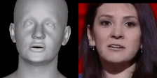
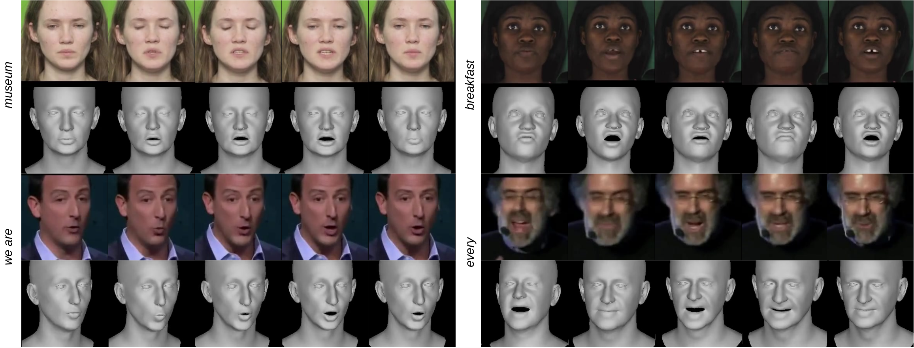

<div align="center">

  # SPECTRE: Visual Speech-Aware Perceptual 3D Facial Expression Reconstruction from Videos

[](https://arxiv.org/abs/2207.11094)
&nbsp; [](https://filby89.github.io/spectre/)
&nbsp; <a href='https://youtu.be/P1kqrxWNizI'>
      
    </a>
</div>

<p align="center"> 


</p>

<p align="center"> 

</p>
<p align="center"> Our method performs visual-speech aware 3D reconstruction so that speech perception from the original footage is preserved in the reconstructed talking head. On the left we include the word/phrase being said for each example. </p>

## Installation
Clone the repository with submodules:
```bash
git clone --recurse-submodules -j4 https://github.com/Sreejaedla1122/SPECTRE
cd spectre
```

Install dependencies:
```bash
pip install torch torchvision torchaudio fvcore iopath
pip install "git+https://github.com/facebookresearch/pytorch3d.git"
pip install -r requirements.txt
```

Install additional external dependencies:
```bash
cd external/face_alignment
pip install -e .
cd ../face_detection
git lfs pull
pip install -e .
cd ../..
```

Install Git LFS if needed:
```bash
curl -s https://packagecloud.io/install/repositories/github/git-lfs/script.deb.sh | sudo bash
sudo apt-get install git-lfs
```

Install gdown:
```bash
pip install gdown
```

### **Additional Setup Requirements**
1. Create an account at [FLAME](https://flame.is.tue.mpg.de/). You will need the username and password while running:
   ```bash
   bash quick_install.sh
   ```

2. Modify the following files before running the demo:
   - `chumpy/__init__.py` and `chumpy/ch.py` require changes. Refer to the Colab notebook in the `notebook` folder for details.
   - `external/Visual_Speech_Recognition_for_Multiple_Languages/tracker/face_tracker.py` also needs modifications. Check the Colab notebook for instructions.

## Running on Google Colab
We provide a Colab notebook for easy setup and execution. You can access it using the following link:

[](notebook/spectre.ipynb)

Follow the instructions in the notebook to set up the environment, download the required models, and run the demo.

## Demo
Run the demo using an example video:
```bash
python demo.py --input samples/LRS3/0Fi83BHQsMA_00002.mp4 --audio
```

To visualize the results inside a Jupyter Notebook:
```python
from IPython.display import HTML
from base64 import b64encode

def show_video(video_path, video_width=600):
    mp4 = open(video_path,'rb').read()
    data_url = "data:video/mp4;base64," + b64encode(mp4).decode()
    return HTML(f"""
    <video width="{video_width}" controls>
        <source src="{data_url}" type="video/mp4">
    </video>
    """)

show_video("logs/demo_output.mp4")
```

## Using the Streamlit App
You can run the Streamlit-based interface for ease of use. First, install Streamlit:
```bash
pip install streamlit
```

Run the Streamlit app:
```bash
streamlit run app.py
```

Once running, you will see a public URL from ngrok that you can use to access the app from any device.

## Training and Testing
Prepare the dataset:
```bash
python utils/extract_frames_and_audio.py --dataset_path ./data/LRS3
bash get_training_data.sh
```

Train the model:
```bash
python main.py --output_dir logs --landmark 50 --relative_landmark 25 --lipread 2 --expression 0.5 --epochs 6 --LRS3_path data/LRS3 --LRS3_landmarks_path data/LRS3_landmarks
```

Test the model:
```bash
python main.py --test --output_dir logs --model_path logs/model.tar --LRS3_path data/LRS3 --LRS3_landmarks_path data/LRS3_landmarks
```

Run lipreading with AV-Hubert:
```bash
python utils/run_av_hubert.py --videos "logs/test_videos_000000/*_mouth.avi" --LRS3_path data/LRS3
```

## Acknowledgements
This repo has been heavily based on the original implementation of [DECA](https://github.com/YadiraF/DECA/). We also acknowledge the following 
repositories which we have benefited greatly from as well:

- [EMOCA](https://github.com/radekd91/emoca)
- [face_alignment](https://github.com/hhj1897/face_alignment)
- [face_detection](https://github.com/hhj1897/face_detection)
- [Visual_Speech_Recognition_for_Multiple_Languages](https://github.com/mpc001/Visual_Speech_Recognition_for_Multiple_Languages)

## Citation
If your research benefits from this repository, consider citing the following:

```
@misc{filntisis2022visual,
  title = {Visual Speech-Aware Perceptual 3D Facial Expression Reconstruction from Videos},
  author = {Filntisis, Panagiotis P. and Retsinas, George and Paraperas-Papantoniou, Foivos and Katsamanis, Athanasios and Roussos, Anastasios and Maragos, Petros},
  publisher = {arXiv},
  year = {2022},
}
